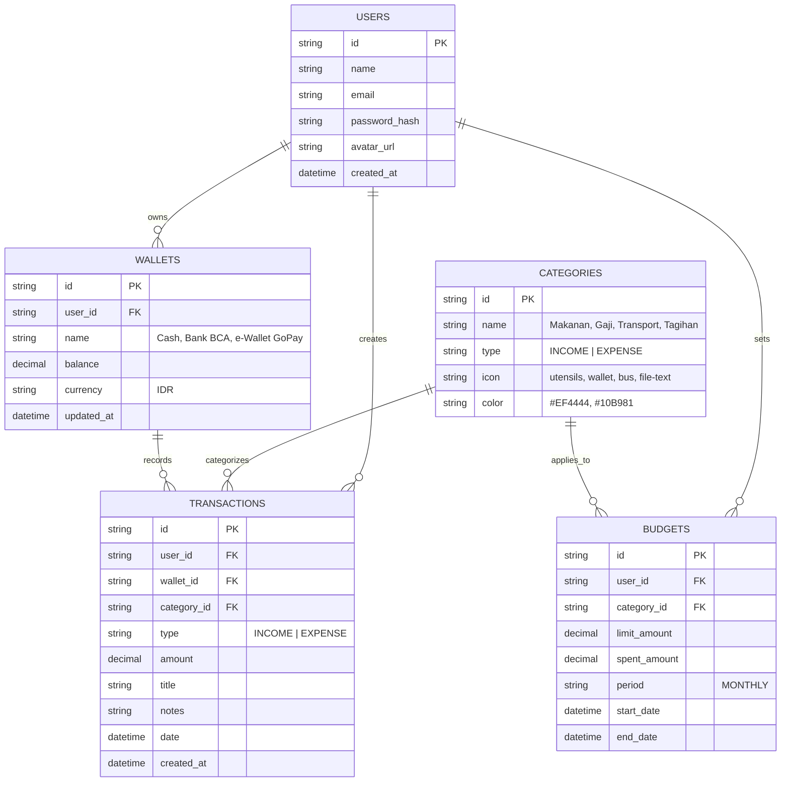

# MoneyMate - Entity Relationship Diagram (ERD)

Berikut adalah perancangan relasi antar entitas database MoneyMate yang digunakan oleh Backend API, Frontend Admin, dan Mobile User App.

```mermaid
erDiagram
    USERS ||--o{ TRANSACTIONS : "creates"
    USERS ||--o{ BUDGETS : "sets"
    USERS ||--o{ WALLETS : "owns"
    CATEGORIES ||--o{ TRANSACTIONS : "categorizes"
    CATEGORIES ||--o{ BUDGETS : "applies_to"
    WALLETS ||--o{ TRANSACTIONS : "records"

    USERS {
        string id PK
        string name
        string email
        string password_hash
        string avatar_url
        datetime created_at
    }

    WALLETS {
        string id PK
        string user_id FK
        string name "Cash, Bank BCA, e-Wallet GoPay"
        decimal balance
        string currency "IDR"
        datetime updated_at
    }

    CATEGORIES {
        string id PK
        string name "Makanan, Gaji, Transport, Tagihan"
        string type "INCOME | EXPENSE"
        string icon "utensils, wallet, bus, file-text"
        string color "#EF4444, #10B981"
    }

    TRANSACTIONS {
        string id PK
        string user_id FK
        string wallet_id FK
        string category_id FK
        string type "INCOME | EXPENSE"
        decimal amount
        string title
        string notes
        datetime date
        datetime created_at
    }

    BUDGETS {
        string id PK
        string user_id FK
        string category_id FK
        decimal limit_amount
        decimal spent_amount
        string period "MONTHLY"
        datetime start_date
        datetime end_date
    }
```
