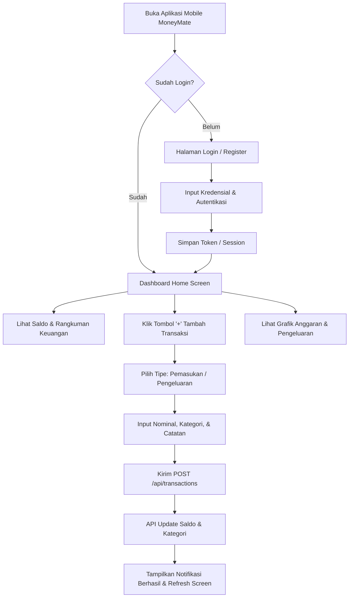
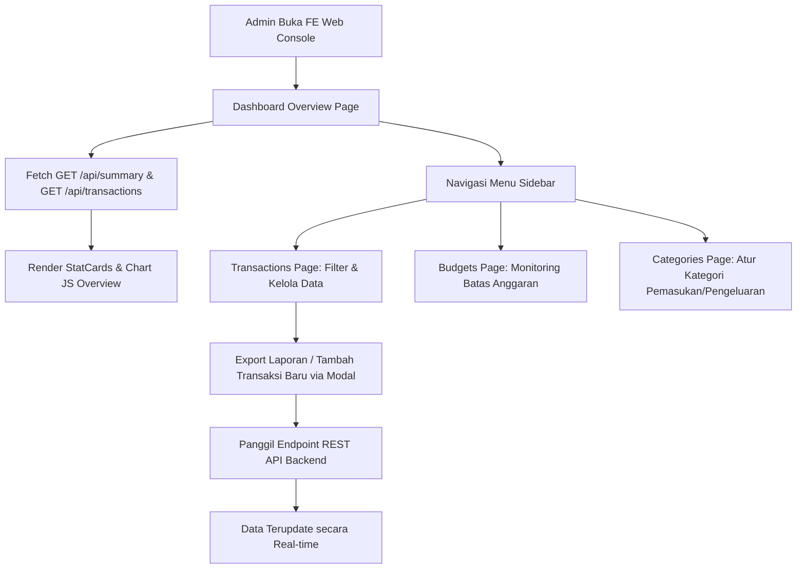

# MoneyMate - Application & User Flowcharts

## 📱 Mobile User App Flow

```mermaid
flowchart TD
    A[Buka Aplikasi Mobile MoneyMate] --> B{Sudah Login?}
    B -- Belum --> C[Halaman Login / Register]
    C --> D[Input Kredensial & Autentikasi]
    D --> E[Simpan Token / Session]
    B -- Sudah --> F[Dashboard Home Screen]
    E --> F

    F --> G[Lihat Saldo & Rangkuman Keuangan]
    F --> H[Klik Tombol '+' Tambah Transaksi]
    F --> I[Lihat Grafik Anggaran & Pengeluaran]

    H --> J[Pilih Tipe: Pemasukan / Pengeluaran]
    J --> K[Input Nominal, Kategori, & Catatan]
    K --> L[Kirim POST /api/transactions]
    L --> M[API Update Saldo & Kategori]
    M --> N[Tampilkan Notifikasi Berhasil & Refresh Screen]
```

---

## 💻 Frontend Admin Web Flow

```mermaid
flowchart TD
    A[Admin Buka FE Web Console] --> B[Dashboard Overview Page]
    B --> C[Fetch GET /api/summary & GET /api/transactions]
    C --> D[Render StatCards & Chart JS Overview]

    B --> E[Navigasi Menu Sidebar]
    E --> F[Transactions Page: Filter & Kelola Data]
    E --> G[Budgets Page: Monitoring Batas Anggaran]
    E --> H[Categories Page: Atur Kategori Pemasukan/Pengeluaran]

    F --> I[Export Laporan / Tambah Transaksi Baru via Modal]
    I --> J[Panggil Endpoint REST API Backend]
    J --> K[Data Terupdate secara Real-time]
```
